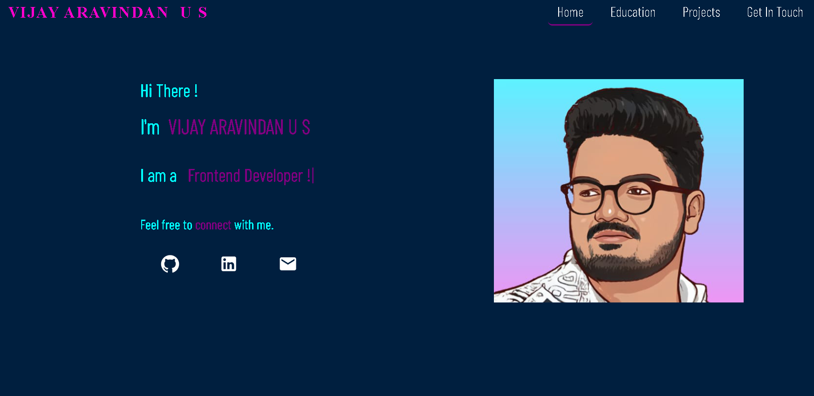
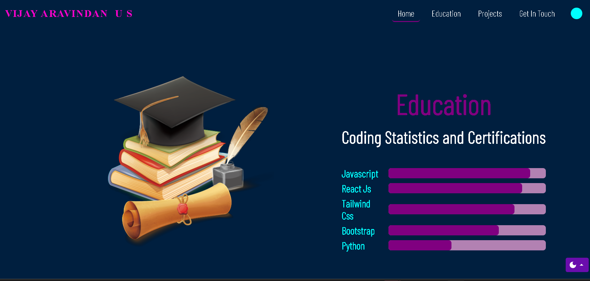
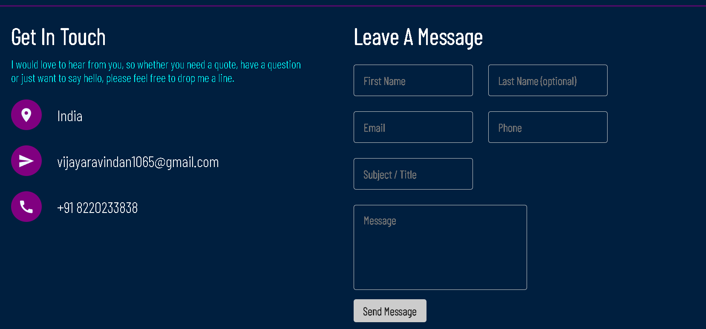

# Vijay Aravindan's Portfolio 🚀

Welcome to my **personal portfolio website**!  
This project showcases my **education, skills, and projects**. It is built with **HTML, CSS, and JavaScript** to create a clean and responsive design.  

---

## 📸 Screenshots
(Add screenshots of your portfolio UI, e.g. `home.png`, `education.png`, `getInTouch.png`)  

-   
-   
-   
-   

---

## 📂 Sections
- **Home** – Introduction & tagline  
- **Education** – My academic background  
- **Professional Skills** – Technical skills & progress bars  
- **Projects** – (Add your projects here if needed)  
- **Get In Touch** – Contact details  

---

## 🚀 Live Demo
Check out my portfolio here:  
👉 [https://portfoliovij.netlify.app](https://portfoliovij.netlify.app)
  

---

## 📞 Contact Me
Let’s connect!  

- **Email:** vijayaravindan1065@gmail.com  
- **LinkedIn:** [www.linkedin.com/in/vijay-aravindan-5a9791244](https://www.linkedin.com/in/vijay-aravindan-5a9791244)  
- **GitHub:** [https://github.com/aravindan345](https://github.com/aravindan345)  

---

## 📜 License
This project is licensed under the MIT License – see the [LICENSE](LICENSE) file for details.

---

⭐ If you like this project, don’t forget to star the repo!
